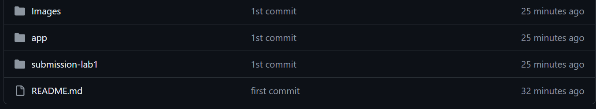
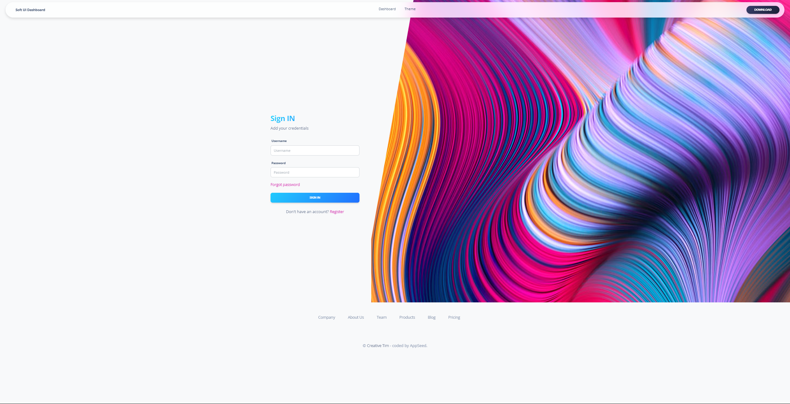
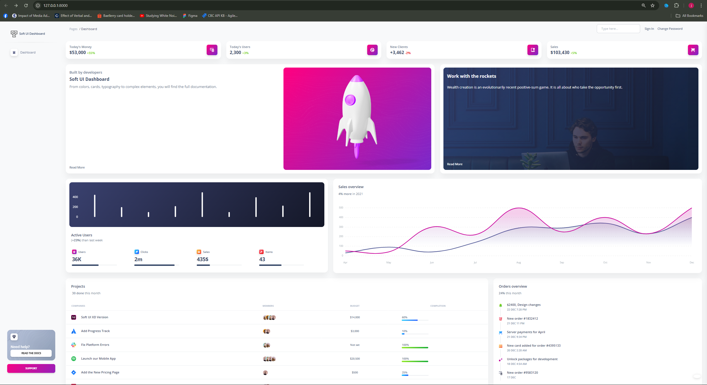
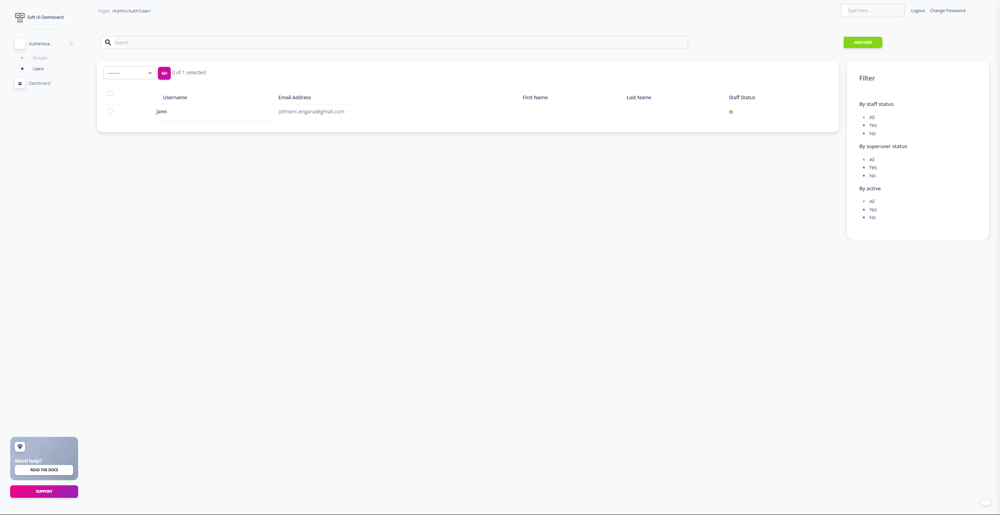
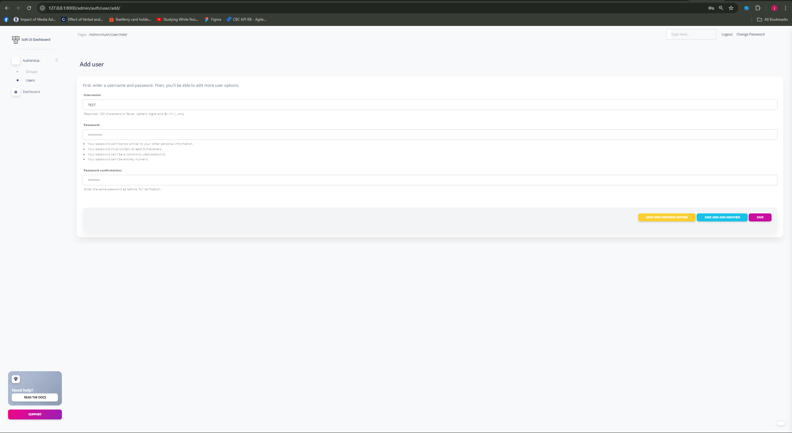
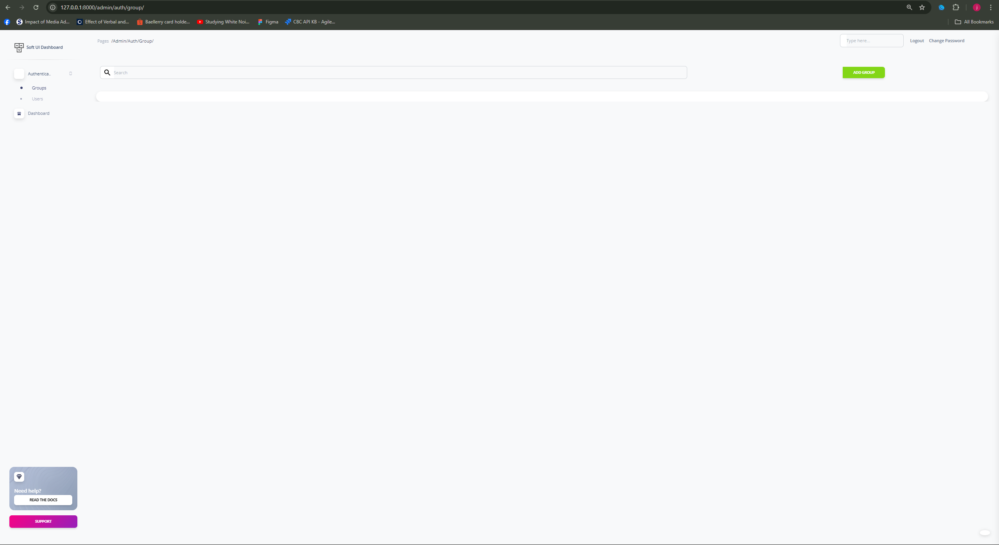
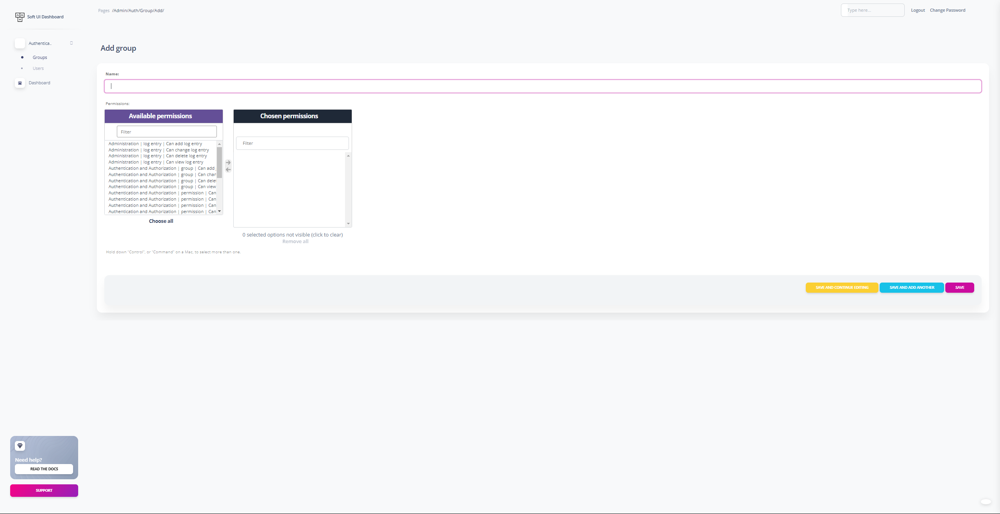

running at 123.0.0.1:8000 (Local Host)

files are located at

GITHUB repo: https://github.com/johnEngana-rgb/Buzzerboy-DJANGO-Developer-Test-v4.0.git

DJANGO starter kit is inside App folder

The following screenshots are features of the starter kit!

Login Page:

DashBoard:

Users page:

Users Page(Add User)

Permissions Page:

Permissions Page(Add permission):
